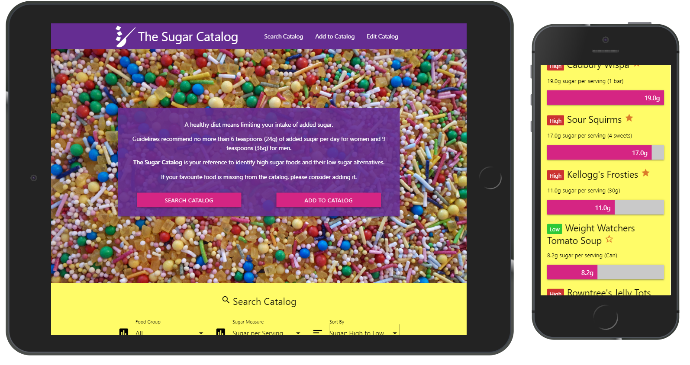
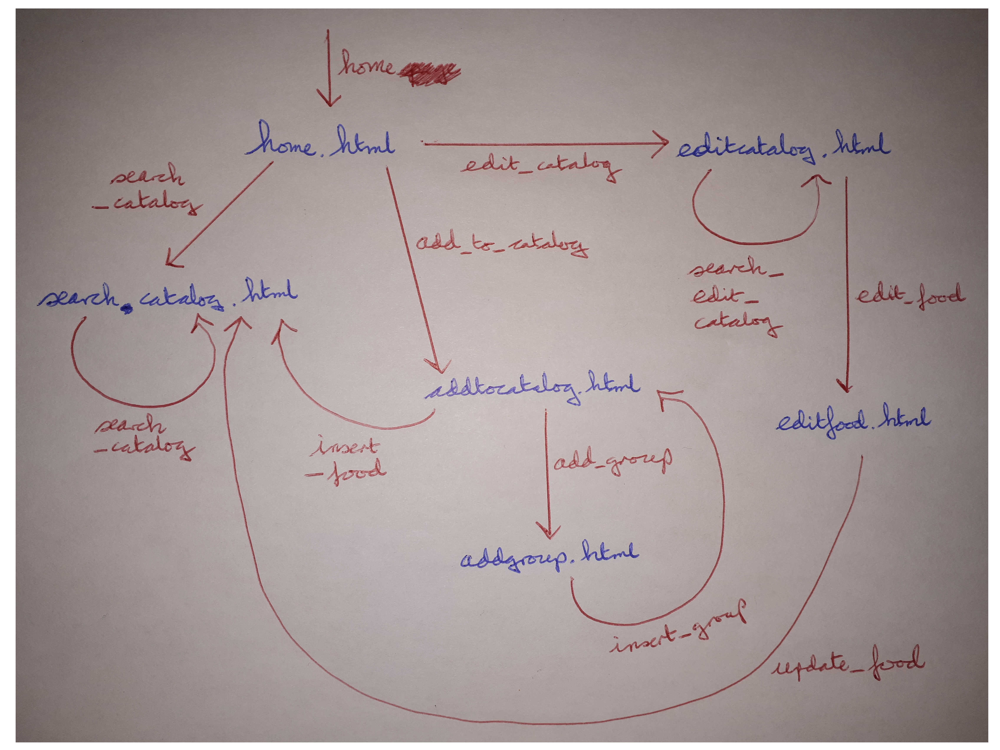

<h1 id="title">The Sugar Catalog</h1>

1. [Introduction](#introduction)
2. [Demo](#demo)
3. [UX](#ux)
4. [Technologies/Libraries](#technologies)
5. [Features](#features)
6. [Testing](#testing)
7. [Deployment](#deployment)
8. [Credits](#credits)

<h2 id="introduction">Introduction</h2>

The Sugar Catalog is a MongoDB-backed Flask app for sharing the sugar content of foods. The motivation for users is that they can compare their favourite foods to other foods in terms of sugar content. The motivation for the site owner is building up a useful database that can be used for educating the community and improving health.

<h2 id="demo">Demo</h2>

A live demo of The Sugar Catalog app can be found [here]() on Heroku.

<h2 id="ux">UX</h2>

### Wireframes

foods
name
group
sugar_g_per_100g
sugar_g_per_serving
serving_description
reviewed

food_groups
group

Conceptual Design - Entity-Relationship Data Model
A food category has many foods.
A drink category has many drinks.
A survey has many questions.
A question has multiple options. One option is correct. The rest are incorrect.
A survey has many responses.
A response has a score (number of correct responses).

Database statistics
Number of Food categories
Number of Drink categories
Number of Foods (by category)
Number of Drinks (by category)
Survey responses.

Recommended daily intake
40g = 4g by 10
Sugar in foods (g/100g or g per serving/portion, % sugar)
Sugar in drinks (g/100ml or g per serving/portion, % sugar based on density of water)

### User Stories
1. As a user, I want to be able to add the sugar content of foods and drinks so that I can share them with the community.
2. As a user, I want to be able to compare the sugar content of foods and drinks so that I can choose options with a lower sugar content.
3. As a user, I want to be able to complete a survey so that I can test my knowledge on the sugar content of foods and drinks.
4. As a user, I want to be able to see the aggregated survey results of everyone who has taken the survey so that I can see how much the community knows about the sugar content of foods and drinks.
5. As a user, I want to be able to see statistics on the database so that I can see how complete a resource the site is.

<h2 id="technologies">Technologies/Libraries</h2>

1. [MongoDB](https://www.mongodb.com/) was used as the NoSQL database for the app.
2. [Python](https://www.python.org/), and specifically [Flask](https://flask.palletsprojects.com/en/1.1.x/), was used as the back-end language.
3. [Jinja](https://jinja.palletsprojects.com/en/2.10.x/) was used as the templating language for rendering the pages.
4. [Materialize](https://materializecss.com/) was used as the front-end framework.
5. Microsoft PowerPoint was used to create the logo.
6. [Gimp](https://www.gimp.org/) was used to reduce the file size of the background photo and thereby speed up how fast it loads.
7. [Heroku](https://www.heroku.com/) was used to deploy the app.

<h2 id="features">Features</h2>

Create: Add sugar content of a food or drink.
Read: List sugar content of foods and drinks.
Update: Edit sugar content of a food or drink.
Delete: sugar content of a food or drink.
Survey
Display survey results
Sorting
Filtering

### Existing
### Future
- Add the ability to add drinks to the sugar catalog. This will involve adding a g per 100ml measure.
- Add error messages if the user fails to enter data correctly in the forms.

<h2 id="testing">Testing</h2>

### General Testing

During development, the Chrome DevTools console was used regularly to log the data to ensure that it was being correctly retrieved from MongoDB.

The HTML was checked using the [W3C Markup Validation Service](https://validator.w3.org/). This identified an incorrectly used paragraph element.

The CSS was checked using the [W3C CSS Validation Service](https://jigsaw.w3.org/css-validator/). This returned one error which said the property "r" does not exist. However, "r" is a property of the circle svg.

### User Story Testing

<h2 id="deployment">Deployment</h2>

The app is deployed on Heroku. Before deploying the app on Heroku, ensure that the project includes the files requirements.txt and Procfile. To create the requirements.txt file, run the following command in the terminal:
pip3 freeze --local > requirements.txt
To create the Procfile, run the following command in the terminal:
echo web: python app.py > Procfile

Next, create a new app within the Heroku web application. Under Settings add the environment variables:
IP
PORT
MONGO_URI (connection string for the MongoDB)

To deploy the app from the local repository, run the following commands in the terminal:
heroku login
git remote add heroku https://git.heroku.com/<insert app name>.git
git push -u heroku master

<h2 id="credits">Credits</h2>

### Content
- The survey questions were adapted from .

### Media
- The background image was taken by myself and edited using Gimp.
- The site logo was created using Microsoft PowerPoint.

### Acknowledgements
* Shortcut icon generated using [Favicon Generator](https://realfavicongenerator.net/) [accessed 12th December 2019].
